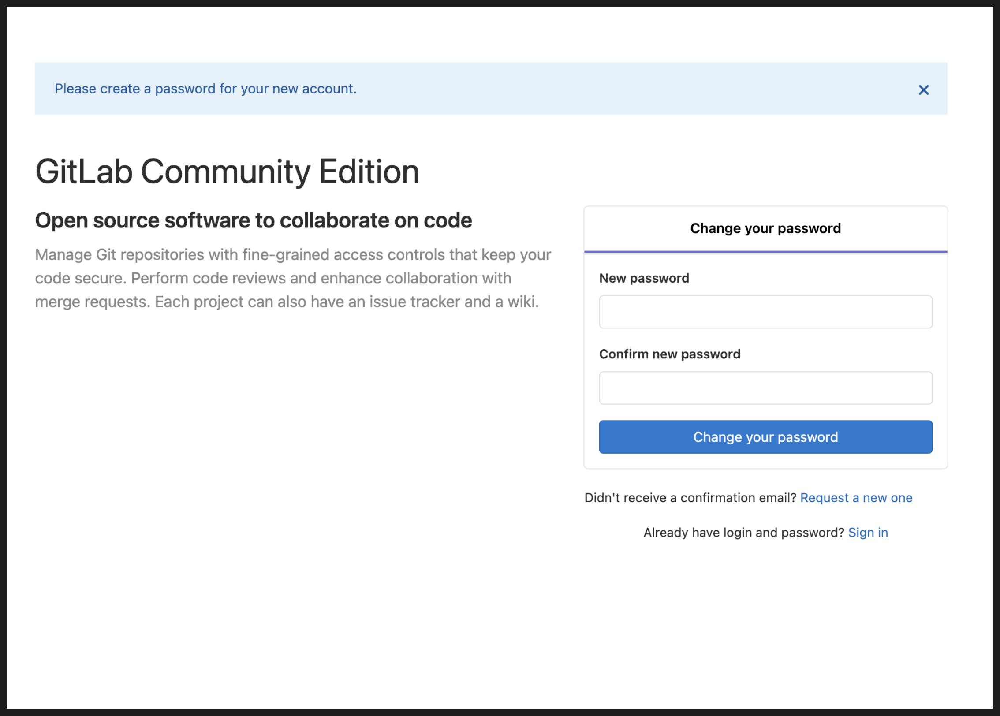

# Projeto de Automação com Cypress - GitLab

Este projeto de automação utiliza o [Cypress](https://www.cypress.io/) para realizar testes automatizados na aplicação GitLab, utilizando a estrutura de Page Object Model (POM). A aplicação GitLab possui tanto Frontend quanto API disponíveis para testes.

## Estrutura do Projeto

A estrutura do projeto segue o padrão de Page Object Model, onde cada página da aplicação é representada por uma classe específica. Isso facilita a manutenção e reutilização do código.

|-- cypress\
| |-- e2e\
| | |-- features\
| |-- fixtures\
| |-- support\
| | |-- apis\
| | |-- elements\
| | | |-- login.elements.json\
| | |-- pages\
| | | |-- login\
| | | | |-- login.page.js\
| | | |-- projeto\
| | | | |-- projeto.page.js\
| | |-- step-definitions\
| | | | |-- login\
| | | | | |-- login.step.js\
| | | | |-- projeto\
| | | | | |-- projeto.step.js\
| | |-- commands.js\
| | |-- e2e.js\
|-- cypress.config.json\
|-- cypress.env.json\
|-- cypress-lock.json\
|-- package.json


- **e2e/features/**: Contém os arquivos de features escritos em Gherkin para cenários de teste.
- **fixtures/**: Contém dados de teste estáticos utilizados nos testes.
- **support/apis/**: Contém as classes que representam chamadas de API.
- **support/elements/**: Contém os seletores dos elementos da UI, organizados em arquivos JSON.
- **support/pages/**: Contém as classes que representam as páginas da aplicação.
- **support/step-definitions/**: Contém as definições dos passos (steps) usados nos arquivos de feature.
- **support/commands.js**: Contém comandos customizados do Cypress.
- **support/e2e.js**: Contém scripts de configuração e inicialização dos testes E2E.
- **cypress.config.json**: Configurações globais do Cypress.
- **cypress.env.json**: Configurações de variáveis de ambiente específicas do Cypress.
- **cypress-lock.json**: Arquivo de lock de dependências do Cypress.
- **package.json**: Configurações e dependências do projeto.

## Pré-requisitos

Antes de começar, certifique-se de ter os seguintes softwares instalados:

- [Node.js](https://nodejs.org/en/) (versão 12 ou superior)
- [Docker](https://www.docker.com/) (versão 26.1.1)
- [git](https://git-scm.com/) (versão 2.45.2)

## Configuração

### 1. Clonar o Repositório

```
bash
git clone https://github.com/dolphinbuzz/cypress_cucumber_pom.git
cd cypress_cucumber_pom
```

### 2. Instalar Dependências

```
npm install
```

### 3. Subir a Aplicação com Docker

Com o docker rodando em seu computador, execute o comando `docker run --publish 80:80 --publish 22:22 --hostname localhost wlsf82/gitlab-ce` e aguarde até o ambiente inicializar.

Depois de alguns minutos, acesse a URL http://localhost para definir a senha do usuário root.

### Definindo a senha do usuário root
Ao acessar a URL http://localhost, você deve ver uma página para trocar a senha do usuário root, conforme abaixo:



Digite uma senha, confirme a mesma e clique no botão Change your password.

### Criando um Access Token
1. Faça login com o usuário `root` com a senha definida na seção anterior
2. Clique no avatar do usuário no canto superior direito da tela; clique no link Settings, e então; clique na opção Access Tokens (no menu lateral esquerdo)
3. No campo nome, digite o valor `key`; na seção _Scopes_ marque a opção __api__; e então, clique no botão _Create personal access token_.

```
Uma mensagem de que o token foi criado com sucesso deve ser exibida, além do token propriamente dito. Copie o token clicando no botão à direita do campo e guarde-o para utilizar na aula 1.
```

### Adicionando uma chave SSH

1. No terminal de linha de comando, digite o seguinte comando e pressione ENTER ``ssh-keygen -t ed25519 -C "root@example.com"``
2. Será solicitado um caminho para salvar a chave. Pressione ENTER para aceitar o caminho padrão
3. Será solicitada uma senha. Pressione ENTER para que a senha não seja necessária
4. Será solicitado que repita a senha. Pressione ENTER novamente para que a senha não seja necessária
5. De novo no terminal de linha de comando, digite o seguinte comando e pressione ENTER para copiar a chave pública recém criada para a área de transferência pbcopy < ~/.ssh/id_ed25519.pub
6. Logado na aplicação com o usuário root, clique no avatar do usuário no canto superior direito da tela; clique no link Settings; e então, clique na opção SSH Keys (no menu lateral esquerdo)
7. Cole sua chave SSH pública no campo key. O campo Title deve ser automaticamente preenchido
8. Por fim, clique no botão Add key.


```
Você também encontrará instruções sobre como gerar a chave SSH em sistema operacional Windows na própria aplicação em teste (rodando em seu ambiente local com Docker) a partir da seguinte URL http://localhost/help/ssh/README#generating-a-new-ssh-key-pair (Instruções em Inglês).
```

__Ok, o ambiente local está pronto!__


### 4. Configurar Variáveis de Ambiente
Se necessário, configure as variáveis de ambiente no arquivo cypress.json para definir URLs, credenciais, etc.

### 5. Executar os Testes
Para executar os testes, use o comando:

```
npx cypress open
```

Isso abrirá a interface gráfica do Cypress, onde você poderá executar os testes. Para executar em modo headless, utilize:

```
npx cypress run
```

Estrutura dos Testes
Cada teste automatizado está organizado em arquivos JavaScript no diretório integration/tests. Esses testes utilizam as classes do Page Object Model localizadas em support/page_objects.


### Contribuição
Contribuições são bem-vindas! Sinta-se à vontade para abrir issues ou enviar pull requests.

### Licença
Este projeto é licenciado sob a [MIT License](LICENSE).